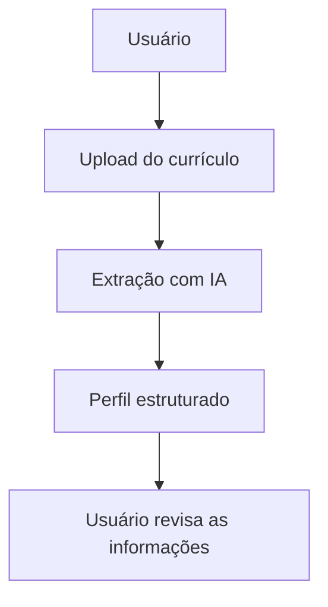
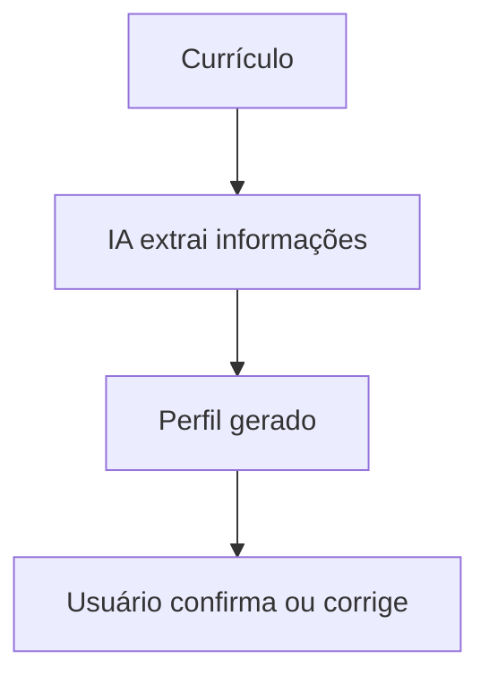
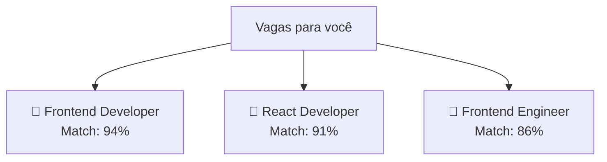
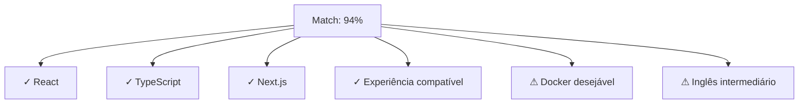
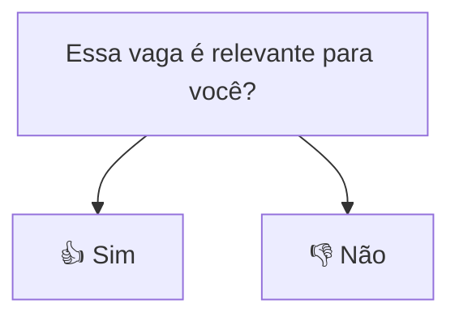
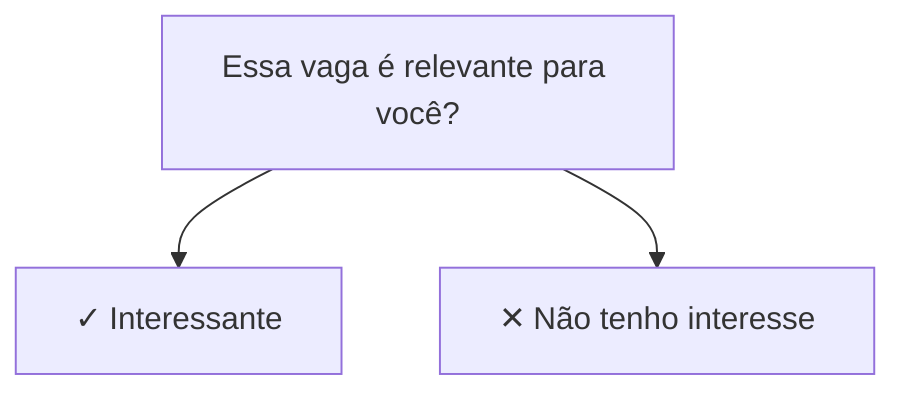
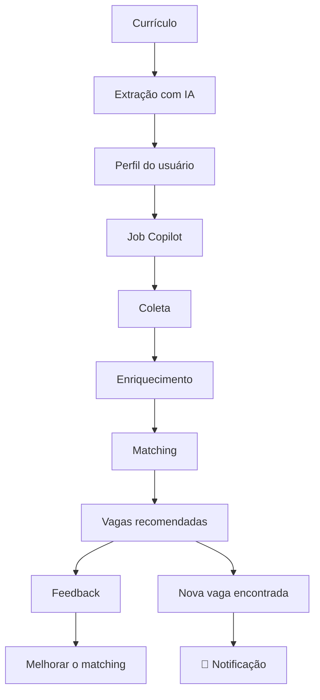

# Funcionalidades do sistema de vagas para validação

## Cadastro e perfil do usuário

Será necessária uma forma de identificar o usuário e armazenar as informações extraídas do currículo.

Por exemplo:

- Nome
- Cargo desejado
- Experiência
- Tecnologias
- Habilidades
- Senioridade
- Localização
- Modelo de trabalho desejado

**O usuário deve ser capaz de editar essas informações.**
A IA pode interpretar o currículo incorretamente. Então o usuário deve poder ajustar seu perfil:

## Preferências de vagas

O currículo sozinho provavelmente não será suficiente para determinar o que o usuário quer.

Por exemplo, seu currículo pode indicar experiência com:

- **React**
- **Next.js**
- **Angular**

Mas talvez você queira procurar apenas:

- **Frontend**
- **React**
- **Next.js**
- **Remoto**

Então eu adicionaria preferências simples:

- Cargos desejados
- Tecnologias de interesse
- Senioridade desejada
- Modelo de trabalho: remoto, híbrido ou presencial
- Localização, quando aplicável

Não precisa criar um sistema complexo de filtros. Apenas informações suficientes para melhorar o match.

## Lista de vagas recomendadas

Essa é uma feature essencial para a validação.

O usuário precisa conseguir acessar algo como:

Ao entrar em uma vaga:

Isso é extremamente importante porque permite ao usuário responder mentalmente:

"*O JobCopilot realmente encontrou vagas que eu teria interesse em aplicar?*"

Essa é a hipótese que estamos tentando validar.

## Feedback sobre o match

Ou:

Por exemplo:

- Match do algoritmo: 92%
- Feedback do usuário: Não interessado

Poderá começar a descobrir:

- O score está funcionando?
- Quais critérios estão pesando demais?
- Quais informações estão sendo ignoradas?
- O LLM está enriquecendo corretamente?
- Usuários diferentes percebem relevância de formas diferentes?

No futuro, esse feedback poderá alimentar a evolução do algoritmo de matching.

### Produto visualmente definido

